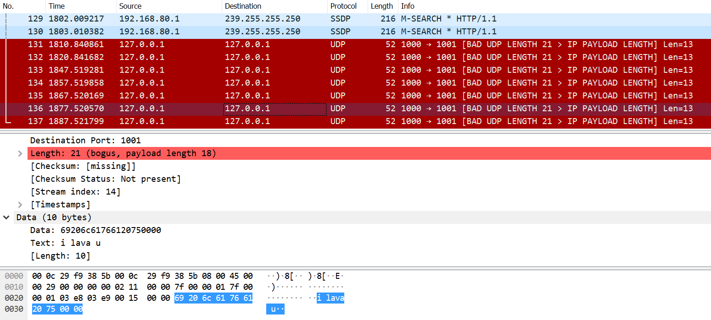

# Lab 2 Data Plane Development Kit(DPDK)

## Part 1: Get familiar with DPDK 

Q1:  

Hugepages is required for allocating large chunks of memory and writing data to them. We can say that hugepages does the same job in DPDK that DMA does in traditional packet processing.

Q2:  

``` c
int ret;
unsigned lcore_id;
ret = rte_eal_init(argc, argv);
if (ret < 0)
  rte_panic("Cannot init EAL\n");
/* call lcore_hello() on every slave lcore */
RTE_LCORE_FOREACH_SLAVE(lcore_id) {
  rte_eal_remote_launch(lcore_hello, NULL, lcore_id);
}
/* call it on master lcore too */
lcore_hello(NULL);
rte_eal_mp_wait_lcore();
return 0;
```

- 主线程运行main，调用了rte_eal_init入口函数，启动基础运行环境
- 启动多核运行环境，RTE_LCORE_FOREACH_SLAVE (lcore_id) 遍历所有EAL指定可以使用的lcore
- 通过rte_eal_remote_launch在每个lcore上，启动被指定的线程。参数lcore_id指定核是将要执行该线程的核，运行函数lcore_hello
- 主线程运行函数lcore_hello， 读取自己的核编号(lcore_id)，打印出“hello from core ？”

Q3:  

- rte_eth_rx_burst - 从端口接收队列上的包到buffer上
- rte_eth_tx_burst - 把buffer的包按队列发送到端口
- rte_eth_dev_socket_id - set up queue for each port
- rte_pktmbuf_pool_create - set up mempool in memory to hold buffer

Q4:  

https://doc.dpdk.org/api/structrte__mbuf.html  

it contains a buffer address with some headroom. Then a large space with few union data including alignment, timestamp, physical address, iova, port etc

## Part 2: send packets with DPDK

### Program Source Code

Attached with submitted folder.  

Virtual os sent "i lava u" with DPDK without getting into kernel. Wireshark in host OS received "i lava u" with virtual network port monitoring. I ignored checksum checking as it is not needed for host testing. So red line warning in Wireshark exists.

### Wireshark Test

  

MENG YIT KOH 517030990022 kmykoh97@sjtu.edu.cn
