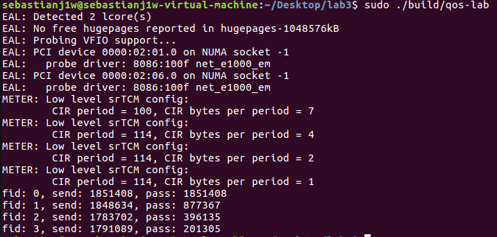
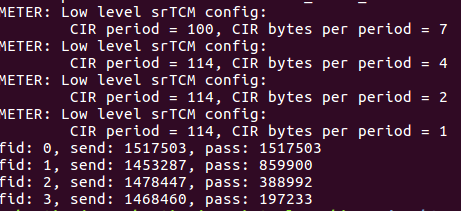
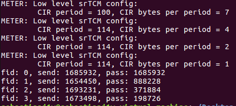

# Lab 3 Quality Of Services(QoS)

## Parameter Deduction

### Meter

1. From main() function, we know that each flow will send about 640*(1000/4)*1000 bytes of data. So flow 0 cir will be this value
2. From flow 0 cir, divide it by half to get flow 1 cir and the rest accordingly.
3. We will try to make all flow 0 packets green. So just set a high value for cbs, ebs.
4. We will try to reduce flow 1's green packets by less than half of flow 0's green packets and the rest into yellow(more than red) and red(more than yellow) packets. We do this by fine-tuning flow 1's cbs, ebs accordingly.
5. Repeat above step for flow 2 and flow 3. Try to make different color packets more logical so the dropper will have an easier time filtering packets later.

### Dropper

1. flow 0 packets are most probably all marked green. So we will just let it all pass. We set min_th, max_th, maxp_inv to be as high as possible but within range.
2. flow 1, 2, 3 parameters are fined tuned accordingly to allow all green packets pass with best efford, yellow packets pass with higher probability and red packets pass with very lower probability. We want most red packets dropped.
3. We will fine-tuned until the bandwith is in 8:4:2:1 ratio.
4. wq_log2 will be set to recommended value.

**The parameters of meter and dropper can be found in qos.c source file**

## DPDK APIs

|API|use|
|---|---|
|rte_get_tsc_cycles|Return the number of TSC cycles since boot|
|rte_meter_srtcm_config|srTCM configuration per metered traffic flow|
|rte_meter_srtcm_color_blind_check|srTCM color blind traffic metering|
|rte_get_tsc_hz|Get the measured frequency of the RDTSC counter|
|rte_red_config_init|Configures a single RED configuration parameter structure|
|rte_red_rt_data_init|Initialises run-time data|
|rte_red_enqueue|Decides if new packet should be enqeued or dropped Updates run time data based on new queue size value. Based on new queue average and RED configuration parameters gives verdict whether to enqueue or drop the packet|

## Result

  

  

  

MENG YIT KOH 517030990022 kmykoh97@sjtu.edu.cn  